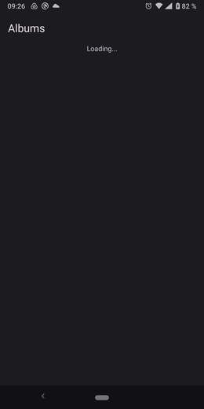
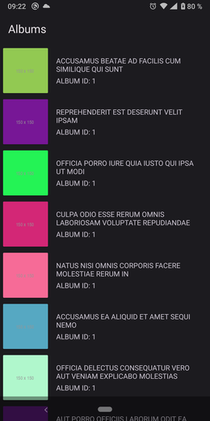

# Albums

Albums is the sample app to demonstrate the Android MVVM Architecture with Hilt, Coroutines, Flows, Retrofit, Paging, Room, Coil, ...

## Screenshots

## Architecture

This sample app try to follows the Clean Architecture, the
[official architecture guidance](https://developer.android.com/topic/architecture)